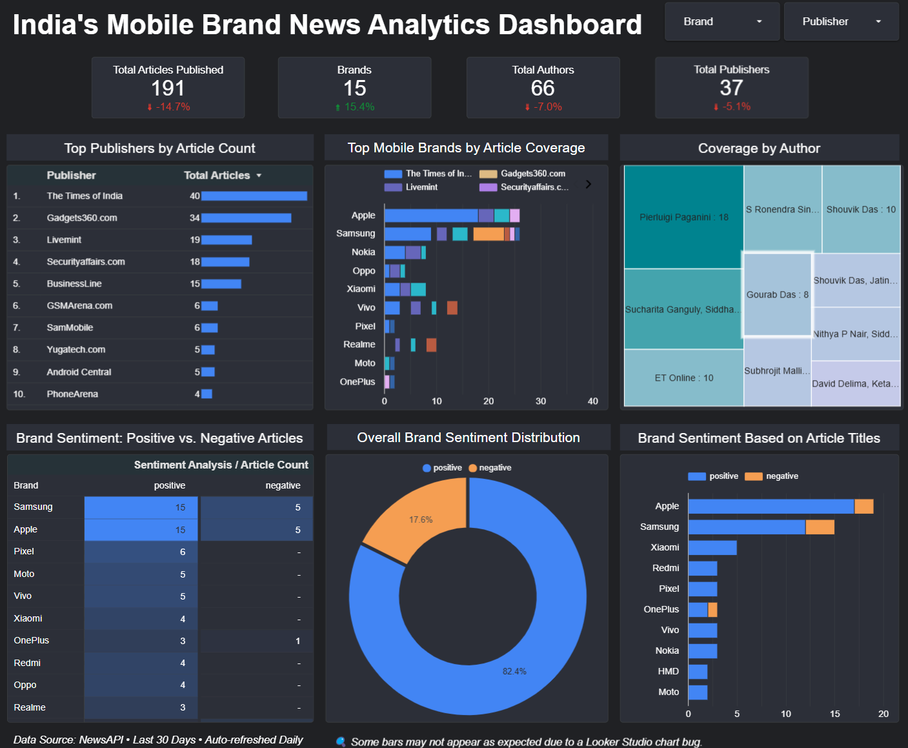

# 📊 Brand Intelligence Dashboards

A live dashboard that analyzes brand visibility and public sentiment from recent news articles — built using NewsAPI, BigQuery, Python, and Looker Studio.

Explore sentiment & visibility of major Mobile, Telecom, and E-commerce brands based on daily news analysis.

🌐 **Live:** [dashboard.kprsnt.in](https://dashboard.kprsnt.in)

---

## 🔍 What It Shows

- Top brands by article volume (Mobile, Telecom, E-commerce)
- Sentiment analysis: positive vs negative mentions
- Publisher & author analysis
- Title-based sentiment vs content sentiment
- Updated daily using an automated pipeline

---

## 🧰 Tools & Stack

| Layer       | Tools Used |
|-------------|-------------|
| Data Source | NewsAPI |
| ETL         | Python, Pandas |
| Storage     | Google BigQuery |
| NLP         | TextBlob Sentiment |
| Dashboard   | Looker Studio |
| Hosting     | Vercel |
| Domain      | dashboard.kprsnt.in |

---

## 📦 Coming Soon

- E-commerce Brand Analysis

